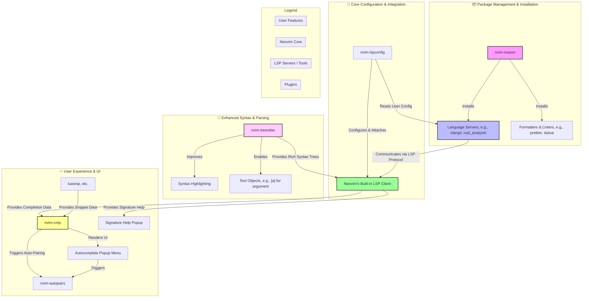

+++
title = "Neovim"
date = 2025-09-23T01:31:05+08:00
draft = false
author = "Anfsity"
tags = [
    "NeoVim",
]
categories = [
    "NeoVim",
]
description = ""
image = ""
+++

## Useful Resources

- [Lua-guide Neovim Docs](https://neovim.io/doc/user/lua-guide.html)
- [Nvim lua guide](https://github.com/nanotee/nvim-lua-guide/blob/master/README.md)
- [Build your first Neovim configuration in lua](https://vonheikemen.github.io/devlog/tools/build-your-first-lua-config-for-neovim/)
- [Stack overflow](https://stackoverflow.com/questions/tagged/lua)
- [Programming in Lua](https://www.lua.org/pil/contents.html)
- [Lua 5.4 Reference Manual](https://www.lua.org/manual/5.4/)
- [Lua Beginners Guide](https://github.com/gridlocdev/lua-beginners-guide)

Also, you can view the documentation by typing `:h lua-guide` in command mode.

---

## A Simpler Choice: NvChad

I stumbled upon an article titled [Environment Configuration Guide/Editor – Neovim Installation & Configuration Tutorial (Based on NvChad)](https://zhuanlan.zhihu.com/p/712125953) and decided to follow the author's setup.

This post serves as a supplement to that article.

We use [NvChad](https://github.com/NvChad/NvChad) to simplify our configuration process and add more user-friendly theming features.

---

## Basic Configuration

After pulling the repository, the first thing we need to modify is `options.lua`.

Open `~/.config/nvim/lua/options.lua`. The default configuration can be found here: [NvChad Options](https://github.com/NvChad/NvChad/blob/v2.5/lua/nvchad/options.lua).

Here is a breakdown of the default configuration:

```lua
local opt = vim.opt
local o = vim.o
local g = vim.g

-------------------------------------- options ------------------------------------------
o.laststatus = 3
o.showmode = false
o.splitkeep = "screen"

o.clipboard = "unnamedplus"
o.cursorline = true
o.cursorlineopt = "number"

-- Indenting
o.expandtab = true
o.shiftwidth = 2
o.smartindent = true
o.tabstop = 2
o.softtabstop = 2

opt.fillchars = { eob = " " }
o.ignorecase = true
o.smartcase = true
o.mouse = "a"

-- Numbers
o.number = true
o.numberwidth = 2
o.ruler = false

-- disable nvim intro
opt.shortmess:append "sI"

o.signcolumn = "yes"
o.splitbelow = true
o.splitright = true
o.timeoutlen = 400
o.undofile = true

-- interval for writing swap file to disk, also used by gitsigns
o.updatetime = 250

-- go to previous/next line with h,l,left arrow and right arrow
-- when cursor reaches end/beginning of line
opt.whichwrap:append "<>[]hl"

-- disable some default providers
g.loaded_node_provider = 0
g.loaded_python3_provider = 0
g.loaded_perl_provider = 0
g.loaded_ruby_provider = 0

-- add binaries installed by mason.nvim to path
local is_windows = vim.fn.has "win32" ~= 0
local sep = is_windows and "\\" or "/"
local delim = is_windows and ";" or ":"
vim.env.PATH = table.concat({ vim.fn.stdpath "data", "mason", "bin" }, sep) .. delim .. vim.env.PATH
```

- `laststatus`: The status bar display mode.
	- `0`: Never show.
	- `1`: Only show if there are at least two windows.
	- `2`: Always show.
	- `3`: Always show, and it is global (one status bar for all splits).

You can visually check the difference by toggling these values.

- `showmode`: Literally what it says, displays the current mode.
- `cursorline`: Highlights the line where the cursor is currently located.
- `cursorlineopt`:
	- `line`: Highlights the entire line.
	- `number`: Highlights the line number.
	- `both`: Highlights both.
- `expandtab`: Converts `\t` (tabs) to spaces when `Tab` is pressed.
- `shiftwidth`: The width for auto-indenting (or shifting via `>>` and `<<`).
- `ignorecase`: Ignores case when searching.
- `mouse`: Mouse support. `a` (all) means mouse support is enabled in all modes.

There are too many options to explain individually. You can check the documentation or type `:h options`.

- [vim.o](https://neovim.io/doc/user/lua-guide.html#_vim.o)
- [options](https://neovim.io/doc/user/options.html)

The configuration provided by `NvChad` is already quite complete. I only made minor modifications to fit my personal habits.

```lua
require "nvchad.options"

local o = vim.o
local opt = vim.opt
-------------------- options ---------------------

-- Common
o.cursorlineopt ='both'

o.list = true
opt.listchars = { tab = "» ", trail = "·", nbsp = "␣" }

-- Indenting
o.expandtab = false
o.shiftwidth = 4
o.showmode = true
o.tabstop = 4
o.softtabstop = 4
```

> If you are confused about `vim.o`, `vim.opt`, etc., these resources might help:
>
> - [Difference between vim.o and vim.opt?](https://www.reddit.com/r/neovim/comments/qgwkcu/difference_between_vimo_and_vimopt/)
> - [Neovim Guide (1): Basic Config](https://youngxhui.top/2023/07/nvim-guideline-1basic-config/)
>
> To be honest, the official documentation is a good choice, but it's hard to read as a beginner. It acts more like a dictionary than a textbook—better for looking things up than for understanding concepts.

---

## Key Mappings

The feel of key mappings is crucial in coding.

`nvim` allows you to customize key bindings using `lua`.

```lua
require "nvchad.mappings"

local map = vim.keymap.set

map("n", ";", ":", { desc = "CMD enter command mode" })

map("i", "<A-h>", "<ESC>^i", { desc = "move beginning of line" })
map("i", "<A-l>", "<End>", { desc = "move end of line" })
map("n", "F", "%", { desc = "jump between match-pair" })


-- use windows like keymaps 
map({ "n", "i", "v" }, "<C-s>", "<cmd> w <cr>", { desc = "file save" })
map({ "n" }, "<C-a>", "ggVG", { desc = "select all file" })
map({ "n", "i", "v" }, "<C-z>", "<cmd> undo <cr>", { desc = "history undo" })
map({ "n", "i", "v" }, "<C-y>", "<cmd> redo <cr>", { desc = "history redo" })
map("n", "<C-/>", "gcc", { desc = "comment toggle", remap = true })
map("i", "<C-/>", "<Esc>gcc^i", { desc = "comment toggle", remap = true })


-- visual studio code like keymaps

map("n", "gb", "<C-o>", { desc = "jump back" })
map("n", "gh", "<cmd> lua vim.lsp.buf.hover() <cr>", { desc = "LSP hover" })map("n", "ge", "<cmd> lua vim.diagnostic.open_float() <cr>", { desc = "LSP show diagnostics" })
map("n", "ge", "<cmd> lua vim.diagnostic.open_float() <cr>", { desc = "LSP show diagnostics" })

map({ "n", "i" }, "<A-j>", "<cmd> :m +1 <cr>", { desc = "move one line down "})
map({ "n", "i" }, "<A-k>", "<cmd> :m -2 <cr>", { desc = "move one line up "})
map("v", "<A-j>", ":m '>+1<CR>gv=gv", { desc = "Move selected lines down" })
map("v", "<A-k>", ":m '<-2<CR>gv=gv", { desc = "Move selected lines up" })
```

This is my personal key mapping table. Of course, this includes the default [mappings](https://github.com/NvChad/NvChad/blob/v2.5/lua/nvchad/mappings.lua) provided by `NvChad`.

The terminal key logic implemented by `NvChad` is very comfortable to use.

Let's break down some common `lua` syntax used here.

`<C>` represents `Ctrl`, `<A>` represents `Alt`, and the default `<Leader>` key is Space.

`remap` is used as a recursive flag. If mapping `A` points to `B`, and I want to create a new mapping `C` that points to `A` to achieve the effect of `B`, I need to tell the `map` function that I want to create such a continuous mapping. In the code above, `gcc` is already a mapping itself, so we need to use `remap`.

Since I use `Linux` as my daily driver, I cannot guarantee that this configuration works equally well on `Windows`.

---

## Plugins

`NvChad` is managed via `LazyNvim`. Note that sometimes lazy loading can cause asynchronous issues, so I don't recommend lazy loading for frequently used features.

Regarding the logic of `lazy.nvim`, please refer to [this article](https://zhuanlan.zhihu.com/p/712125953):

```lua
-- Custom lazy.nvim install path
local lazypath = vim.fn.stdpath "data" .. "/lazy/lazy.nvim"

-- If lazy.nvim doesn't exist, clone it from Git to the specified path
if not vim.uv.fs_stat(lazypath) then
  local repo = "https://github.com/folke/lazy.nvim.git"
  vim.fn.system { "git", "clone", "--filter=blob:none", repo, "--branch=stable", lazypath }
end

-- Add lazy.nvim's install path to Neovim's runtime path so Neovim can find it
vim.opt.rtp:prepend(lazypath)

-- The file required here is `lua/configs/lazy.lua`, which contains basic config for lazy.nvim
local lazy_config = require "configs.lazy"

-- Load plugins via lazy.nvim
-- lazy.nvim will automatically download and load plugins specified in `.setup`
require("lazy").setup({
  -- Load NvChad first
  {
    "NvChad/NvChad",
    lazy = false,
    branch = "v2.5",
    import = "nvchad.plugins",
  },

  -- Then look for and load plugins from the `plugins/` directory 
  -- (i.e., `lua/plugins/` in your current config folder)
  { import = "plugins" },
}, lazy_config)
```

> Logic referenced from [Environment Configuration Guide/Editor – Neovim Installation & Configuration Tutorial (Based on NvChad)](https://zhuanlan.zhihu.com/p/712125953).

Here, `require("lazy").setup()` requires a `table` as a return value to accept the configuration.

Similarly, inside the `plugins` folder, it doesn't have to be a single `init.lua`; it can be multiple `*.lua` files.

Let's look at the general format for installing plugins with `lazy.nvim`:

```lua
return {
  -- the colorscheme should be available when starting Neovim
  {
    "folke/tokyonight.nvim",
    lazy = false, -- make sure we load this during startup if it is your main colorscheme
    priority = 1000, -- make sure to load this before all the other start plugins
    config = function()
      -- load the colorscheme here
      vim.cmd([[colorscheme tokyonight]])
    end,
  },

  -- I have a separate config.mappings file where I require which-key.
  -- With lazy the plugin will be automatically loaded when it is required somewhere
  { "folke/which-key.nvim", lazy = true },

  {
    "nvim-neorg/neorg",
    -- lazy-load on filetype
    ft = "norg",
    -- options for neorg. This will automatically call `require("neorg").setup(opts)`
    opts = {
      load = {
        ["core.defaults"] = {},
      },
    },
  },
-- ... (omitted similar examples for brevity)
```

> Config from [lazy.nvim examples](https://lazy.folke.io/spec/examples)

It basically returns an array containing multiple [Plugin Specs](https://lazy.folke.io/spec). You noticed that the length of each array varies; `lazy.nvim` supports returning a single `Spec` or an array containing multiple `Specs`, allowing you to organize your plugin configuration flexibly.

`"folke/tokyonight.nvim"` represents the `github` repository name, allowing `lazy.nvim` to automatically pull code from `github`.

`lazy = false` indicates whether to enable lazy loading. `false` means it is disabled (load immediately). Note that there is also an `event` directive, which also implies lazy loading, but enables the plugin when the specific `event` occurs.

`opts` and `config` are passed to the plugin's `setup()` function as a `Lua table` or a function returning a `Lua table`. Due to logic issues, I recommend using `opts` instead of `config` in scenarios like this, although they are equivalent:

```lua
return {
  "stevearc/conform.nvim",
  config = function()
    require("conform").setup({})
  end
}
```

```lua
return {
  "stevearc/conform.nvim",
  opts = {}
}
```

`config` supports more complex logic. That is, when logical operations are needed, we use `config`; when just declaring configuration and describing requirements, we should use `opts`. In most use cases, we should use `opts`.

It's worth noting that if you want to install a plugin that is a native `vim` plugin, we need to call the `init` method.

```lua
return {
    {
        "mg979/vim-visual-multi",
        lazy = false,
        init = function ()
            vim.g.VM_maps = {
                ["Find Under"] = '<C-f>',
            }
            vim.g.VM_maps_disable = {
                ["i"] = "A",
            }
        end,
    },
}
```

The `dependencies` option describes the dependencies required by the repository, facilitating `lazy.nvim` to pull and maintain them.

Next, we need to prepare for the `LSP` service and organize the framework under the `nvim` folder to suit our personal habits:

```zsh
├── lua
│   ├── autocmds.lua
│   ├── chadrc.lua
│   ├── configs
│   │   ├── conform.lua
│   │   ├── highlight.lua
│   │   ├── lazy.lua
│   │   ├── lsp.lua
│   │   ├── luasnip.lua
│   │   └── ui.lua
│   ├── lua_snippets
│   │   └── snippets.lua
│   ├── mappings.lua
│   ├── options.lua
│   └── plugins
│       ├── comments.lua
│       ├── conform.lua
│       ├── highlight.lua
│       ├── lsp.lua
│       ├── luasnip.lua
│       ├── motions.lua
│       ├── tools.lua
│       └── ui.lua
```

If you need further introduction to plugins, you can check the Zhihu article mentioned earlier. Now, let's take a big step towards our goal -- configuring **LSP**.

Btw, regarding `snippets` which was not mentioned in that article: this is a very common feature in IDEs. In `Neovim`, we use the `luasnip` plugin to get this functionality.

`luasnip` provides several related APIs. `luasnip.s` provides the interface for the `snippet`. I use two interfaces: `luasnip.extras.fmt` (a formatting tool provided by `luasnip`) and `luansip.t` (which uses the `vscode` snippet format). So, you can migrate from `vscode` completely painlessly.

```lua
local luaSnip = require("luasnip")

-- snippet
local s = luaSnip.s
-- insert node
local i = luaSnip.i
-- text node
local t = luaSnip.t
-- formatter tool
local fmt = require("luasnip.extras.fmt").fmt

luaSnip.add_snippets("cpp", {
    s(
        { trig = "demo", name = "Competitive Programming Template", dscr = "A template for competitive programming. "},
        t({
        -- some vsocde like snippets here
        })
    )
}
```

Finally, you need to turn off `lazyload` for this plugin. `Lazy.nvim` has some bugs that cause plugins to fail to enable correctly. I haven't investigated the details, but I suspect it's an async issue caused by lazy loading.

## LSP (Language Server Protocol)

I have to admit, `LSP` might be the most complex part of configuring `Neovim`. This is perhaps the most crucial part of this article; only when it's configured can you enjoy full code completion on `Neovim` — but first, what is LSP?

Simply put, the `LSP` protocol consists of two core components: the `Language Client` and the `Language Server`. As the name suggests, the `Language Client` is responsible for rendering the user interface (highlighting, hover hints), monitoring user actions, and converting them into language-specific requests to forward to the `Language Server`. The `Language Server` is responsible for receiving information from the `Language Client`, processing it, and sending the results (code completion, error messages, etc.) back to the `Language Client`.

The protocol separates the "frontend" and "backend" logic of full language support. From then on, `Editors/IDEs` only need to implement the `Language Client`, while language developers and maintainers only need to implement the `Language Server`. This greatly reduces the workload for developers and improves the user experience.

Historically, each `Editor/IDE` was responsible for implementing features for corresponding languages. This led to different implementation methods for supporting the same language across editors, varying degrees of support, and developers having to maintain implementations for multiple platforms, doing a lot of repetitive work. It also led to vast differences in experience across different editors. To solve this, Microsoft proposed the `LSP` protocol.

This is a very rough understanding of `LSP`, but it's not the main point of this article. If you are interested in the `LSP` protocol, you might want to try reading Microsoft's [documentation](https://microsoft.github.io/language-server-protocol/overviews/lsp/overview/).

`Neovim` has built-in [interfaces](https://neovim.io/doc/user/lsp.html) for language servers since version `0.5+`. You can use `Neovim`'s own interfaces to implement a fully functional `LSP` client, but we don't need to reinvent the wheel (although doing so for a single language isn't complex, it gets increasingly complicated as you maintain more languages, and it's not easy to migrate or backup) — others have already paved the way. A plugin called [nvim-lspconfig](https://github.com/neovim/nvim-lspconfig) contains `LSP` configurations for many mainstream languages. Just load this plugin, and these configurations will automatically load into `Neovim`.
And all you need is a simple `vim.lsp.enable(...)`.



The diagram above illustrates the communication between `Neovim`'s built-in `LSP Client` and its plugins. Common plugins include `lsp-config` for simplified configuration, `nvim-autopairs` and `nvim-cmp` for code completion, `Mason` as the package manager, and `nvim-treesitter` responsible for more complete code highlighting and error UI.

Configuring `lsp-config` is not complicated. Below, we'll use `lua_ls` as an example to explain the entire configuration flow.

First, it should be mentioned that while `lsp-config` helps you configure `LSP`, it doesn't install them for you. We use the `Mason` plugin to automatically install the required `LSP`, `DAP`, `linters`, etc. Use `:Mason` to call up the `Mason` panel, `g?` to view related shortcuts, and `/` to search. The usage is simple and the hints are comprehensive, so I won't go into detail here.

```lua
local mr = require "mason-registry"

local nvlsp = require "nvchad.configs.lspconfig"

local eagerly_installed_langs = { ... }
--- A pre-install list
local ensure_installed = {
  ["*"] = { "typos_lsp" },
  --- typos_lsp is a language server for spell checking
  Bash = { "bashls", "shellcheck", "shfmt" },
  C = { "clangd", "clang-format" },
  ...
}
--- List of mandatory installations

--- vim.api.nvim_create_autocmd creates an autocommand
--- An autocommand executes a callback function automatically when a specific event occurs
--- LspAttach is the event we are listening for, triggered when a language server successfully attaches to a buffer
vim.api.nvim_create_autocmd("LspAttach", {
  callback = function(args)
    nvlsp.on_attach(_, args.buf)
    --- on_attach function implemented by NvChad
    --- This function is usually responsible for LSP-related shortcuts in this buffer
    --- _ in Lua represents a discarded variable
  end,
})

--- vim.lsp.config is a core config function of nvim-lspconfig plugin
vim.lsp.config("*", {
	--- on_attach is a callback function provided by nvim-lspconfig
	--- client is the language server communicating with the buffer, bufnr is the current buffer number
    on_attach = function(client, bufnr)
        if client.supports_method("textDocument/inlayHint") or client.server_capabilities.inlayHintProvider then
            vim.lsp.inlay_hint.enable(true, { bufnr = bufnr })
        end
        --- If the current language server supports inlayHint, we enable it

        --- Similar functionality
        if client.supports_method("textDocument/codeLens", { bufnr = bufnr }) then
            vim.lsp.codelens.refresh { bufnr = bufnr }
            vim.api.nvim_create_autocmd({ "BufEnter", "InsertLeave" }, {
                --- Listen to two events: BufEnter (enter buffer), InsertLeave (leave insert mode)
                buffer = bufnr,
                --- This command only applies to the current buffer
                callback = function()
                    vim.lsp.codelens.refresh { bufnr = bufnr }
                end,
            })
        end
    end,
    on_init = nvlsp.on_init,
    capabilities = nvlsp.capabilities,
})

--- Start: LuaLS config
--- 
dofile(vim.g.base46_cache .. "lsp")
--- dofile is a built-in Lua function to execute a Lua file directly
--- vim.g.base56_cache is the path set by NvChad
require("nvchad.lsp").diagnostic_config()
--- This is also the diagnostic style implemented by NvChad

local lua_ls_settings = {
  Lua = {
	hint = {
		enable = true,
		paramName = "Literal",
	},
	--- Enable inlay hints, a feature I really like
	--- Literal: only show parameter names when the function argument is a literal
	codeLens = {
		enable = true,
	},
	--- Show the reference count of the function
    workspace = {
      maxPreload = 1000000,
      --- Set the max total size for preloading and analysis by lua_ls on startup, in bytes
      preloadFileSize = 10000,
      --- Set the max size of a single file for preloading by lua_ls, in bytes
    },
  },
}

-- If current working directory is Neovim config directory
local in_neovim_config_dir = (function()
  local stdpath_config = vim.fn.stdpath "config"
  --- Anonymous function, getting nvim's config directory path
  local config_dirs = type(stdpath_config) == "string" and { stdpath_config } or stdpath_config
  --- Ensure config_dirs is always a list
  ---@diagnostic disable-next-line: param-type-mismatch
  for _, dir in ipairs(config_dirs) do
    if vim.fn.getcwd():find(dir, 1, true) then
      return true
    end
  end
end)()

--- The following configuration is only enabled in the nvim config directory
--- It will not affect regular Lua projects
if in_neovim_config_dir then
  -- Add vim to globals for type hinting
  lua_ls_settings.Lua.diagnostic = lua_ls_settings.Lua.diagnostic or {}
  lua_ls_settings.Lua.diagnostic.globals = lua_ls_settings.Lua.diagnostic.globals or {}
  table.insert(lua_ls_settings.Lua.diagnostic.globals, "vim")

  -- Add all plugins installed with lazy.nvim to `workspace.library` for type hinting
  lua_ls_settings.Lua.workspace.library = vim.list_extend({
    vim.fn.expand "$VIMRUNTIME/lua",
    vim.fn.expand "$VIMRUNTIME/lua/vim/lsp",
    "${3rd}/busted/library", -- Unit testing
    "${3rd}/luassert/library", -- Unit testing
    "${3rd}/luv/library", -- libuv bindings (`vim.uv`)
  }, vim.fn.glob(vim.fn.stdpath "data" .. "/lazy/*", true, true))
  --- The purpose of the code above is to automatically include the source code directories of all plugins
  --- into the completion scope of lua_ls.
end

vim.lsp.config("lua_ls", {
  settings = lua_ls_settings,
})
```

This logic might seem a bit complex, but apart from a function determining if it's in the `nvim` config directory and the corresponding handling, the rest of the logic is quite simple.

The author of the [Zhihu article](https://zhuanlan.zhihu.com/p/712125953) also used `mason-lspconfig` to automate the installation of corresponding language servers. I don't have that need, and the code is quite long, so I didn't look at it closely.

Mastering these is enough to configure features specific to other language servers. A quick note on `clangd`: the `inlayHint` check above won't be triggered by `clangd`. If you want to use the `inlayHint` provided by `clangd`, you can hardcode it like I did, since we know it supports this feature anyway.

```lua
vim.lsp.config("clangd", {
    on_attach = function (_, bufnr)
        vim.lsp.inlay_hint.enable(true, { bufnr = bufnr })
    end,

    single_file_support = true,

    cmd = {
        "clangd",
        "--clang-tidy",
        "--j=12",
        "--background-index",
        "--header-insertion=never",
        "--inlay-hints=true",
        "--fallback-style=LLVM, indent=4",
    }
})
```

That's about it for the main body of `LSP`. It's not actually complicated, but it's easy to get confused when you first start.

By now, you should have a performant editor. `Neovim` also supports many extensions, such as formatting, Copilot, background beautification, etc. You can check that Zhihu article for these. Basically, any feature you can experience on `VSCode`, `Neovim` can achieve, and faster—the downside is that configuration is more troublesome. But once configured, you can pull your config from GitHub anytime, anywhere. Plus, isn't it fun to craft a custom editor with your own hands?

---

## Conclusion

Actually, this post is more like a supplement to details and omissions in that Zhihu article. Writing it also helped deepen my familiarity with this tool. Finally, here is the link to my [personal repository](https://github.com/anfsity/my-neovim-config).