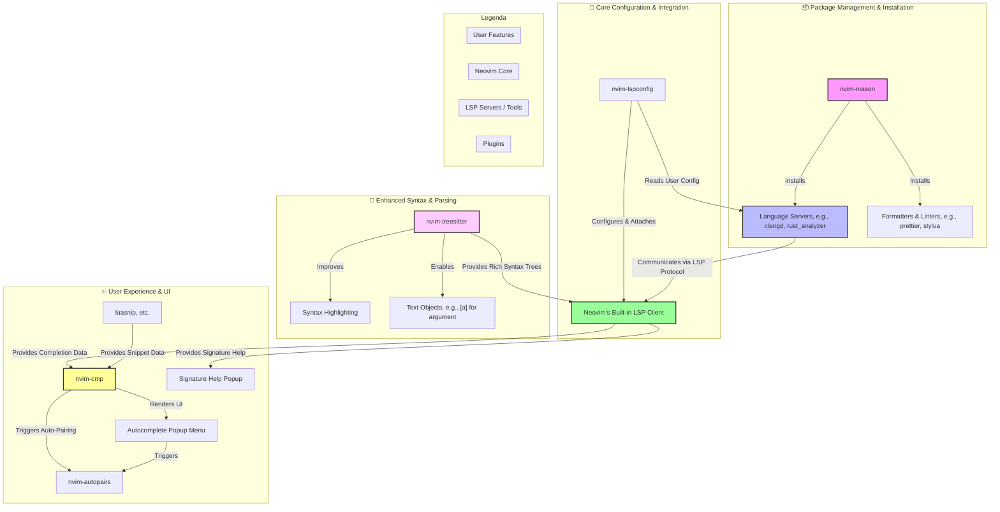

+++
title = "Neovim"
date = 2025-09-23T01:31:05+08:00
draft = false
author = "Anfsity"
tags = [
    "NeoVim",
]
categories = [
    "NeoVim",
]
description = ""
image = ""
+++

## 一些有用的资料

- [Lua-guide Neovim Docs](https://neovim.io/doc/user/lua-guide.html)
- [Nvim lua guide](https://github.com/nanotee/nvim-lua-guide/blob/master/README.md)
- [Build your first Neovim configuration in lua](https://vonheikemen.github.io/devlog/tools/build-your-first-lua-config-for-neovim/)
- [Stack overflow](https://stackoverflow.com/questions/tagged/lua)
- [Programming in Lua](https://www.lua.org/pil/contents.html)
- [Lua 5.4 Reference Manual](https://www.lua.org/manual/5.4/)
- [Lua Beginners Guide](https://github.com/gridlocdev/lua-beginners-guide)

以及, 你可以在命令模式下输入 `:h lua-guide` 中查看文档.

---

## 更加简单的选择-NvChad

偶然间看到一文[环境配置指南/编辑器 – Neovim 安装配置教程（基于 NvChad）](https://zhuanlan.zhihu.com/p/712125953) 便决定跟随作者进行配置。

本文基于该文章的内容进行补充叙述。

我们使用 [NvChad](https://github.com/NvChad/NvChad) 来简化我们的配置流程和添加更加易用的主题功能。

---

## 基本配置

下拉仓库后， 我们首先来修改 `options.lua`。

我们打开 `~/.config/nvim/lua/options.lua` ， 默认配置可以在这里访问 [NvChad](https://github.com/NvChad/NvChad/blob/v2.5/lua/nvchad/options.lua) 。

接下来我们对他的默认配置做一些讲解。

```lua
local opt = vim.opt
local o = vim.o
local g = vim.g

-------------------------------------- options ------------------------------------------
o.laststatus = 3
o.showmode = false
o.splitkeep = "screen"

o.clipboard = "unnamedplus"
o.cursorline = true
o.cursorlineopt = "number"

-- Indenting
o.expandtab = true
o.shiftwidth = 2
o.smartindent = true
o.tabstop = 2
o.softtabstop = 2

opt.fillchars = { eob = " " }
o.ignorecase = true
o.smartcase = true
o.mouse = "a"

-- Numbers
o.number = true
o.numberwidth = 2
o.ruler = false

-- disable nvim intro
opt.shortmess:append "sI"

o.signcolumn = "yes"
o.splitbelow = true
o.splitright = true
o.timeoutlen = 400
o.undofile = true

-- interval for writing swap file to disk, also used by gitsigns
o.updatetime = 250

-- go to previous/next line with h,l,left arrow and right arrow
-- when cursor reaches end/beginning of line
opt.whichwrap:append "<>[]hl"

-- disable some default providers
g.loaded_node_provider = 0
g.loaded_python3_provider = 0
g.loaded_perl_provider = 0
g.loaded_ruby_provider = 0

-- add binaries installed by mason.nvim to path
local is_windows = vim.fn.has "win32" ~= 0
local sep = is_windows and "\\" or "/"
local delim = is_windows and ";" or ":"
vim.env.PATH = table.concat({ vim.fn.stdpath "data", "mason", "bin" }, sep) .. delim .. vim.env.PATH
```

- `laststauts` ： 状态栏显示模式。
  - `0` : 从不显示
  - `1` : 只有超过一个窗口才显示
  - `2` : 总是显示
  - `3` : 总是显示， 并且是全局的。

具体区别可以使用控制变量法直观查看。

- `showmode` ： 字面意思， 时候显示当前模式。
- `cursorline` ： 高亮显示光标所在的当前行。
- `cursorlineopt`
  - `line` 高亮整行。
  - `number` 高亮行号。
  - `both` 都高亮。
- `expandtab` ：按下 `Tab` 后， 是否将 `/t` 转化为空格。
- `shiftwidth` ： 当执行自动缩进时，包括智能缩进， 一次缩进或取消缩进的宽度。
- `ignorecase` ： 搜索时忽略大小写。
- `mouse` 鼠标支持， `a` (all) 表示所有模式下都支持鼠标。

实在是很多， 每个都解释太过麻烦。查阅文档或者 `:h options` 。

- [vim.o](https://neovim.io/doc/user/lua-guide.html#_vim.o)
- [options](https://neovim.io/doc/user/options.html)

`NvChad` 提供的配置已经非常完善了，我仅仅对其做了小部分修改以符合我的个人习惯。

```lua
require "nvchad.options"

local o = vim.o
local opt = vim.opt
-------------------- options ---------------------

-- Common
o.cursorlineopt ='both'

o.list = true
opt.listchars = { tab = "» ", trail = "·", nbsp = "␣" }

-- Indenting
o.expandtab = false
o.shiftwidth = 4
o.showmode = true
o.tabstop = 4
o.softtabstop = 4
```

> 如果你对 vim.o ，vim.opt 等感到疑惑，这些内容也许可以帮助你。
>
> [Difference between vim.o and vim.opt?](https://www.reddit.com/r/neovim/comments/qgwkcu/difference_between_vimo_and_vimopt/)
>
> [neovim入门指南(一)：基础配置](https://youngxhui.top/2023/07/nvim-guideline-1basic-config/)
>
> 其实官方文档也是一个不错的选择， 但是选择官方文档不太可能。太难阅读了。
>
> 他的定位更像是字典而不是教科书，更适合查阅，而不是理解。

---

## 快捷键

快捷键的使用在 coding 中的使用体感是非常重要的。

`nvim` 支持你使用 `lua` 自定义快捷键操作。

```lua
require "nvchad.mappings"

local map = vim.keymap.set

map("n", ";", ":", { desc = "CMD enter command mode" })

map("i", "<A-h>", "<ESC>^i", { desc = "move beginning of line" })
map("i", "<A-l>", "<End>", { desc = "move end of line" })
map("n", "F", "%", { desc = "jump between match-pair" })


-- use windows like keymaps
map({ "n", "i", "v" }, "<C-s>", "<cmd> w <cr>", { desc = "file save" })
map({ "n" }, "<C-a>", "ggVG", { desc = "select all file" })
map({ "n", "i", "v" }, "<C-z>", "<cmd> undo <cr>", { desc = "history undo" })
map({ "n", "i", "v" }, "<C-y>", "<cmd> redo <cr>", { desc = "history redo" })
map("n", "<C-/>", "gcc", { desc = "comment toggle", remap = true })
map("i", "<C-/>", "<Esc>gcc^i", { desc = "comment toggle", remap = true })


-- visual studio code like keymaps

map("n", "gb", "<C-o>", { desc = "jump back" })
map("n", "gh", "<cmd> lua vim.lsp.buf.hover() <cr>", { desc = "LSP hover" })map("n", "ge", "<cmd> lua vim.diagnostic.open_float() <cr>", { desc = "LSP show diagnostics" })
map("n", "ge", "<cmd> lua vim.diagnostic.open_float() <cr>", { desc = "LSP show diagnostics" })

map({ "n", "i" }, "<A-j>", "<cmd> :m +1 <cr>", { desc = "move one line down "})
map({ "n", "i" }, "<A-k>", "<cmd> :m -2 <cr>", { desc = "move one line up "})
map("v", "<A-j>", ":m '>+1<CR>gv=gv", { desc = "Move selected lines down" })
map("v", "<A-k>", ":m '<-2<CR>gv=gv", { desc = "Move selected lines up" })
```

这是一份我的个人快捷键配置表。当然，这也包括了 `NvChad` 默认提供给你的[快捷键](https://github.com/NvChad/NvChad/blob/v2.5/lua/nvchad/mappings.lua)。

`NvChad` 实现的有关终端的一套快捷键逻辑使用的十分舒适。

接下来我们来解析一下常用的 `lua` 语句。

`<C>` 代表 `ctrl` ， `<A>` 代表 `Alt` ，默认的主键 `<Leader>` 是空格。

`remap` 作为递归标志来使用，如果说映射 `A` 指向 `B` ，现在我想要创建一个新的映射 `C` 通过指向 `A` 来做到使用 `B` 的效果，此时就需要告诉 `map` 函数，我要创建一个这样的连续映射，请帮我创建。在代码中 `gcc` 本身其实就已经是一个映射了，所以我们需要使用 `remap`。

由于我使用 `linux` 作为自己的主力机器，不保证该配置在 `windows` 上同样有用。

---

## 插件

`NvChad` 通过 `LazyNvim` 进行管理，需要注意的是，有的时候懒加载会导致异步问题，对于常用的功能，我并不推荐进行懒加载处理。

关于 `lazy.nvim` 的逻辑，请参考[该文](https://zhuanlan.zhihu.com/p/712125953)的内容 ：

```lua
-- 自定义的 lazy.nvim 安装路径
local lazypath = vim.fn.stdpath "data" .. "/lazy/lazy.nvim"

-- 如果 lazy.nvim 不存在，则通过 Git 克隆它到指定路径
if not vim.uv.fs_stat(lazypath) then
  local repo = "https://github.com/folke/lazy.nvim.git"
  vim.fn.system { "git", "clone", "--filter=blob:none", repo, "--branch=stable", lazypath }
end

-- 将 lazy.nvim 的安装路径添加到 Neovim 的运行时路径中，以便 Neovim 能找到它
vim.opt.rtp:prepend(lazypath)

-- 这里引入的文件就是 `lua/configs/lazy.lua`，它包含了 lazy.nvim 的一些基本配置
local lazy_config = require "configs.lazy"

-- 通过 lazy.nvim 加载插件
-- lazy.nvim 会自动下载在 `.setup` 中指定的插件并加载它们
require("lazy").setup({
  -- 先加载 NvChad
  {
    "NvChad/NvChad",
    lazy = false,
    branch = "v2.5",
    import = "nvchad.plugins",
  },

  -- 然后从 `plugins/` 目录（也就是你当前配置文件夹的 `lua/plugins/` 目录）中查找插件并加载
  { import = "plugins" },
}, lazy_config)
```

> 该逻辑引用自此文[环境配置指南/编辑器 – Neovim 安装配置教程（基于 NvChad）](https://zhuanlan.zhihu.com/p/712125953)

这里 `require("lazy").setup()` 需要一个 `table` 作为作为返回值来接受。

同理，在 `plugins` 文件夹里面的不必是一个 `init.lua` ，也可以是一个很多的 `*.lua` 。

让我们看看 `lazy.nvim` 安装插件的通用格式 ：

```lua
return {
  -- the colorscheme should be available when starting Neovim
  {
    "folke/tokyonight.nvim",
    lazy = false, -- make sure we load this during startup if it is your main colorscheme
    priority = 1000, -- make sure to load this before all the other start plugins
    config = function()
      -- load the colorscheme here
      vim.cmd([[colorscheme tokyonight]])
    end,
  },

  -- I have a separate config.mappings file where I require which-key.
  -- With lazy the plugin will be automatically loaded when it is required somewhere
  { "folke/which-key.nvim", lazy = true },

  {
    "nvim-neorg/neorg",
    -- lazy-load on filetype
    ft = "norg",
    -- options for neorg. This will automatically call `require("neorg").setup(opts)`
    opts = {
      load = {
        ["core.defaults"] = {},
      },
    },
  },

  {
    "dstein64/vim-startuptime",
    -- lazy-load on a command
    cmd = "StartupTime",
    -- init is called during startup. Configuration for vim plugins typically should be set in an init function
    init = function()
      vim.g.startuptime_tries = 10
    end,
  },

  {
    "hrsh7th/nvim-cmp",
    -- load cmp on InsertEnter
    event = "InsertEnter",
    -- these dependencies will only be loaded when cmp loads
    -- dependencies are always lazy-loaded unless specified otherwise
    dependencies = {
      "hrsh7th/cmp-nvim-lsp",
      "hrsh7th/cmp-buffer",
    },
    config = function()
      -- ...
    end,
  },

  -- if some code requires a module from an unloaded plugin, it will be automatically loaded.
  -- So for api plugins like devicons, we can always set lazy=true
  { "nvim-tree/nvim-web-devicons", lazy = true },

  -- you can use the VeryLazy event for things that can
  -- load later and are not important for the initial UI
  { "stevearc/dressing.nvim", event = "VeryLazy" },

  {
    "Wansmer/treesj",
    keys = {
      { "J", "<cmd>TSJToggle<cr>", desc = "Join Toggle" },
    },
    opts = { use_default_keymaps = false, max_join_length = 150 },
  },

  {
    "monaqa/dial.nvim",
    -- lazy-load on keys
    -- mode is `n` by default. For more advanced options, check the section on key mappings
    keys = { "<C-a>", { "<C-x>", mode = "n" } },
  },

  -- local plugins need to be explicitly configured with dir
  { dir = "~/projects/secret.nvim" },

  -- you can use a custom url to fetch a plugin
  { url = "git@github.com:folke/noice.nvim.git" },

  -- local plugins can also be configured with the dev option.
  -- This will use {config.dev.path}/noice.nvim/ instead of fetching it from GitHub
  -- With the dev option, you can easily switch between the local and installed version of a plugin
  { "folke/noice.nvim", dev = true },
}
```

> 配置来自于[lazy.nvim](https://lazy.folke.io/spec/examples)

里面其实返回了一个包含多个 [Plugin Spec](https://lazy.folke.io/spec) 的数组，你肯定发现了，每一个数组的长短都不一定相同， `lazy.nvim` 支持你返回单个 `Spec` 或者包含多个 `Spec` 的数组，方便你更灵活的组织你的插件配置。

`"folke/tokyonight.nvim"` 代表的是 `github` 仓库名称，用于让 `lazy.nvim` 自动从 `github` 上拉取代码。

`lazy = false` 代表是否启用懒加载， `false` 代表启用。默认是 `false`。 需要注意的是，同时有一个 `event` 指令，同样代表启用懒加载 ，并且在相关的 `event` 发生时，启用插件。

`opts` 和 `config` 是传递给该插件的 `setup()` 函数的一个 `Lua table` 或者一个返回 `Lua table` 的函数。由于逻辑的问题，我更推荐在下面这种情景使用 `opts` 而不是 `config` ，虽然两者是等价的 ：

```lua
return {
  "stevearc/conform.nvim",
  config = function()
    require("conform").setup({})
  end
}
```

```lua
return {
  "stevearc/conform.nvim",
  opts = {}
}
```

`config` 支持的逻辑更为复杂，也就是说，当要进行逻辑操作时，我们要使用 `config` ，而仅仅声明配置和描述需求时，我们应该使用 `opts` 。在绝大部分的使用场景，我们都应该使用 `opts` 而不是 `config` 。

值得注意的是，如果你想要安装的插件是属于 `vim` 的原生插件，我们需要调用 `init` 方法。

```lua
return {
    {
        "mg979/vim-visual-multi",
        lazy = false,
        init = function ()
            vim.g.VM_maps = {
                ["Find Under"] = '<C-f>',
            }
            vim.g.VM_maps_disable = {
                ["i"] = "A",
            }
        end,
    },
}
```

`dependencies` 选项描述了该仓库所需要的依赖项，便于 `lazy.nvim` 拉取和维护。

接下来我们便需要为 `lsp` 服务来做准备了，顺便对 `nvim` 文件夹下面的框架进行整理和调整，让它更符合我们个人的使用习惯 ：

```zsh
├── lua
│   ├── autocmds.lua
│   ├── chadrc.lua
│   ├── configs
│   │   ├── conform.lua
│   │   ├── highlight.lua
│   │   ├── lazy.lua
│   │   ├── lsp.lua
│   │   ├── luasnip.lua
│   │   └── ui.lua
│   ├── lua_snippets
│   │   └── snippets.lua
│   ├── mappings.lua
│   ├── options.lua
│   └── plugins
│       ├── comments.lua
│       ├── conform.lua
│       ├── highlight.lua
│       ├── lsp.lua
│       ├── luasnip.lua
│       ├── motions.lua
│       ├── tools.lua
│       └── ui.lua
```

如果你需要接着看插件相关的内容介绍，你可以查阅之前知乎上的那篇文章。接下来我们就需要大跨步朝着我们的目标迈进 -- 配置 `LSP`。

btw, 关于那篇文章没有提到的 `snippets` ， 这是 `IDE` 里面一个很常见的功能，而在 `NeoVim` 当中， 我们要使用插件 `luasnip` 来获得这样的功能。

`luasnip` 提供了多个相关的 API ， `luasnip.s` 提供就是 `snippet` 的接口。我使用的有两个接口， 一种是 `luasnip.extras.fmt` ，是 `luasnip` 提供的一个格式化工具 ，另一个是 `luansip.t` ，使用的是 `vscode` 的 `snippet` 格式。所以你可以完全无痛的从 `vscode` 迁移过来。

```lua
local luaSnip = require("luasnip")

-- snippet
local s = luaSnip.s
-- insert node
local i = luaSnip.i
-- text node
local t = luaSnip.t
-- formatter tool
local fmt = require("luasnip.extras.fmt").fmt

luaSnip.add_snippets("cpp", {
    s(
        { trig = "demo", name = "Competitive Programming Template", dscr = "A template for competitive programming. "},
        t({
        -- some vsocde like snippets here
        })
    )
}
```

最后， 你需要关掉插件的 `lazyload` ，`Lazy.nvim` 会出现些许 bug 导致插件无法被正确启用。我没有细究里面的细节，大概的怀疑方向是懒加载导致的异步问题。

## LSP(Language Server Protocol)

需要承认的是， `LSP` 可能是配置 `Neovim` 最复杂的一部分。这或许也是这篇文章最重要的一部分，只有配置好了它，你才能在 `Neovim` 上享受完整的代码补全能力 ------ but first, what is LSP ?

简单来说 , `LSP` 协议包含两个核心组件， `Language Client` 和 `Language Server` ，正如字面意思，`Language Client` 负责用户界面的渲染 (高亮，悬浮提示) ，监听用户的行为并将其转化特定语言的请求转发给 `Language Server` 。而 `Language Server` 负责接收 `Language Client` 的信息进行处理，并且将结果 (代码补全，错误信息等) 回转给 `Language Client` 。

协议使得完整语言支持的 "前端" 和 "后端" 逻辑分离了。自此，`编辑器/IDE` 只需要负责实现 `Language Client` ，而语言的开发者和维护者只需要负责实现 `Language Server` 。会大大减小开发者的工作量和用户的体验舒适程度。

在历史上，本来是由各个 `编辑器/IDE` 负责实现对应语言的相关功能，这就导致了各个 `编辑器/IDE` 对相同语言支持有着不同的实现方法，对各种语言的支持程度也各不相同，开发者不得不维护多个平台对应功能的实现，做大量的重复劳动。而且也导致在不同编辑器上使用的体感差异很大。为了解决这个问题，微软提出了 `LSP` 协议。

这就是对 `lsp` 一个非常粗略的理解，但这毕竟不是本文的重点。如果你对 `lsp` 协议很感兴趣，不妨尝试阅读一下微软的[文档](https://microsoft.github.io/language-server-protocol/overviews/lsp/overview/)。

`NeoVim` 在 `0.5+` 版本以后，内置了语言服务器的[接口](https://neovim.io/doc/user/lsp.html) 。你可以使用 `NeoVim` 自身的接口来实现功能完善的 `lsp` 客户端，但是我们不必如此造轮子 (纵使这么做对单独一个语言来说并不复杂，但是你需要维护的语言越来越多的时候，这种操作就越来越复杂，而且也不便于迁移备份) ------ 早有先人为你做好了准备。一个叫做 [nvim-lspconfig](https://github.com/neovim/nvim-lspconfig) 的插件包含了许多主流语言的 `lsp` 配置，只要加载该插件，这些配置就会自动的加载到 `NeoVim` 当中。
而你只需要一句简单的 `vim.lsp.enable(...)`。



上面这个图表讲述了 `Neovim` 内置的 `LSP Client` 和其插件之间的通信。常见的插件有 `lsp-config` 简化配置，`nvim-autopairs` 和 `nvim-cmp`提供插件的代码补全，`Mason` 是包管理器， `nvim-treesitter` 和 `legenda` 负责更加完善的代码高亮和错误提示的 UI。

`lsp-config` 的配置并不复杂，下面我们以配置自己的 `lua_ls` 为例，讲解一下整个的配置流程。

首先要提的是，`lsp-config` 虽然会帮你配置 `lsp` ，但是它不会帮你安装他。我们使用 `Mason` 插件来自动的安装所需的 `lsp`，`DAP` ，`linter` 等等。使用 `:Mason` 调用 `Mason` 的面板，用 `g?` 查看相关的快捷键，使用 `/` 搜索，用法很简单，提示也给的很全，这里就不再赘述了。

```lua
local mr = require "mason-registry"

local nvlsp = require "nvchad.configs.lspconfig"

local eagerly_installed_langs = { ... }
--- 一个预安装列表
local ensure_installed = {
  ["*"] = { "typos_lsp" },
  --- typos_lsp 是一个检查拼写的语言服务器
  Bash = { "bashls", "shellcheck", "shfmt" },
  C = { "clangd", "clang-format" },
  ...
}
--- 必须安装的列表

--- vim.api.nvim_create_autocmd 创建一个自动命令
--- 自动命令指的是，当某个特定时间发生时，自动执行一个回调函数
--- LspAttach 是我们监听的事件名称，当一个语言服务器成功附加到一个缓冲区时，事件被触发
vim.api.nvim_create_autocmd("LspAttach", {
  callback = function(args)
    nvlsp.on_attach(_, args.buf)
    --- nvchad 实现的 on_attach 函数
    --- 这个函数通常负责这个缓冲区里面和 lsp 相关的快捷键
    --- _ 在 lua 中表示被抛弃的变量
  end,
})

--- vim.lsp.config 是 nvim-lspconfig 插件的一个核心配置函数
vim.lsp.config("*", {
	--- on_attach 是 nvim-lspconfig 提供的一个回调函数
	--- client 是当前正在和缓冲区进行通信的语言服务器， bufnr 是当前缓冲区的编号
    on_attach = function(client, bufnr)
        if client.supports_method("textDocument/inlayHint") or client.server_capabilities.inlayHintProvider then
            vim.lsp.inlay_hint.enable(true, { bufnr = bufnr })
        end
        --- 如果当前的语言服务器支持 inlayhint, 我们就开启他

        --- 功能类似
        if client.supports_method("textDocument/codeLens", { bufnr = bufnr }) then
            vim.lsp.codelens.refresh { bufnr = bufnr }
            vim.api.nvim_create_autocmd({ "BufEnter", "InsertLeave" }, {
                --- 监听两个事件， bufenter 进入这个缓冲区， insertlaeve 离开插入模式
                buffer = bufnr,
                --- 这个命令只对当前缓冲区生效
                callback = function()
                    vim.lsp.codelens.refresh { bufnr = bufnr }
                end,
            })
        end
    end,
    on_init = nvlsp.on_init,
    capabilities = nvlsp.capabilities,
})

--- Start: LuaLS config
---
dofile(vim.g.base46_cache .. "lsp")
--- dofile 是 lua 的一个内置函数，用来直接执行一个 lua 文件的代码
--- vim.g.base56_cache 是 nvchad 设置的路径
require("nvchad.lsp").diagnostic_config()
--- 这个也是 nvchad 实现的诊断信息的样式

local lua_ls_settings = {
  Lua = {
	hint = {
		enable = true,
		paramName = "Literal",
	},
	--- 启用行内提示，这个功能我很喜欢
	--- 字面量，仅在函数参数为字面量的时候才显示参数名称
	codeLens = {
		enable = true,
	},
	--- 显示函数的被引用次数
    workspace = {
      maxPreload = 1000000,
      --- 设置 lua_ls 启动时预加载和分析的最大总大小，单位是 bytes
      preloadFileSize = 10000,
      --- 设置 lua_ls 预加载的单个文件最大大小，单位是 bytes
    },
  },
}

-- If current working directory is Neovim config directory
local in_neovim_config_dir = (function()
  local stdpath_config = vim.fn.stdpath "config"
  --- 匿名函数，这一句是在获取 nvim 的配置目录路径
  local config_dirs = type(stdpath_config) == "string" and { stdpath_config } or stdpath_config
  --- 确保 config_dirs 总是一个 list
  ---@diagnostic disable-next-line: param-type-mismatch
  for _, dir in ipairs(config_dirs) do
    if vim.fn.getcwd():find(dir, 1, true) then
      return true
    end
  end
end)()

--- 下面的配置只针对在 nvim 的配置目录下启用，并不会影响常规的 lua 项目
if in_neovim_config_dir then
  -- Add vim to globals for type hinting
  lua_ls_settings.Lua.diagnostic = lua_ls_settings.Lua.diagnostic or {}
  lua_ls_settings.Lua.diagnostic.globals = lua_ls_settings.Lua.diagnostic.globals or {}
  table.insert(lua_ls_settings.Lua.diagnostic.globals, "vim")

  -- Add all plugins installed with lazy.nvim to `workspace.library` for type hinting
  lua_ls_settings.Lua.workspace.library = vim.list_extend({
    vim.fn.expand "$VIMRUNTIME/lua",
    vim.fn.expand "$VIMRUNTIME/lua/vim/lsp",
    "${3rd}/busted/library", -- Unit testing
    "${3rd}/luassert/library", -- Unit testing
    "${3rd}/luv/library", -- libuv bindings (`vim.uv`)
  }, vim.fn.glob(vim.fn.stdpath "data" .. "/lazy/*", true, true))
  --- 以上代码的作用在于，自动的将所有插件的源代码目录包含进 lua_ls 的补全范围内。
end

vim.lsp.config("lua_ls", {
  settings = lua_ls_settings,
})
```

这个逻辑可能稍显复杂，不过除了一个判断是否在 `nvim` 配置文件目录下的一个函数，和与此对应的处理方式以外，其余的逻辑都是非常简单的。

[环境配置指南/编辑器 – Neovim 安装配置教程（基于 NvChad）](https://zhuanlan.zhihu.com/p/712125953) 文章的作者还使用了 `mason-lspconfig` 以自动化安装对应的语言服务器，我没有这个方面的需求，而且代码也比较长，就没有仔细看了。

掌握了这些，就足以配置其他语言服务器特有的功能了。这里提一嘴 `clangd`，上面的有关 `inlayhint` 的检测不会被 `clangd` 触发，如果你想使用 `clangd` 提供的 `inlayhint` ，可以像我这样硬编码它，反正我们也知道它支持这个功能。

```lua
vim.lsp.config("clangd", {
    on_attach = function (_, bufnr)
        vim.lsp.inlay_hint.enable(true, { bufnr = bufnr })
    end,

    single_file_support = true,

    cmd = {
        "clangd",
        "--clang-tidy",
        "--j=12",
        "--background-index",
        "--header-insertion=never",
        "--inlay-hints=true",
        "--fallback-style=LLVM, indent=4",
    }
})
```

有关 `lsp` 的主体就大概这么多内容了，其实并不复杂，但是刚接触的时候确实很容易混淆。

到目前为止，你已经可以拥有一个性能不错的编辑器了。`NeoVim` 还支持许多拓展，比如格式化，Copilot，背景美化等等，这些内容你可以查看知乎的那篇文章。可以说，你在 `vscode` 上能够体验的功能，`NeoVim` 都能够实现，而且更快，缺点是配置起来比较麻烦。但一旦配好了，你就可以随时随地的从 github 上下拉配置，而且自己亲手打造一个自定义的编辑器，也很有趣不是吗?

---

## 结语

其实这篇文章更像是我对于知乎那篇文章的一些细节与遗漏的一些内容进行补充与完善，写它也是为了加深我对这个工具的熟悉程度。最后附上我自己的[仓库连接](https://github.com/anfsity/my-neovim-config) 。
